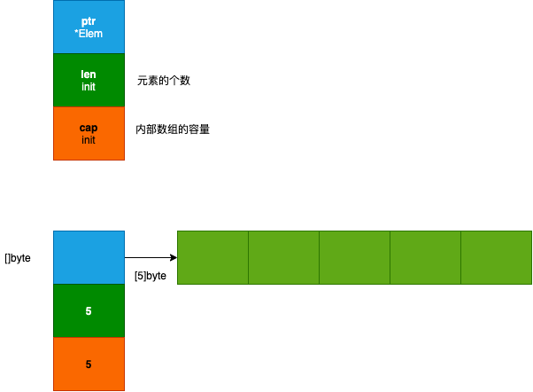
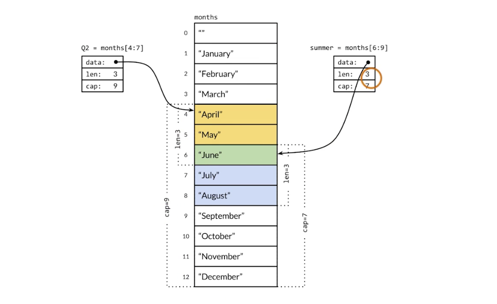

# 数组和切片

接下来看一些数据集合。

## 数组

### 数组的声明

```go
var a [3]int // 声明并初始化为默认零值
a[0] = 1

b := [3]int{1, 2, 3} // 声明同时初始化
c := [2][2]int{{1, 2}, {3, 4}} // 多维数组初始化
```

 `[3]int{1, 2, 3}`
 - [3] 数组的大小
 - int 数组类型
 - {1,2,3} 初始化值，默认都是 0

有时候如果不想挨个去数有多少个元素，可以写成 `[...]int{1, 2, 3}` 会自动根据初始化的参数长度设置数组大小。

### 数组元素的遍历

与其他主要编程语言的差异

```go
func TestTravelArray(t *testing.T) {
  arr := [...]int{1, 2, 3, 4, 5} // 不指定元素个数
  // 传统方式
  for i :=0; i < len(arr); i++ {
    t.Log(arr[i])
  }
  // go 类似的语法 range
  for idx/*索引*/, elem/*元素*/ := range arr {
    fmt.Println(idx. elem)
  }
  // 如果我们不关心 idx，可以使用 _ 进行占位
  for _, el := range arr {
    t.Log(el)
  }
}
```

### 数组截取

a[开始索引(包含), 结束索引(不包含)]

```go
a := [...]int{1, 2, 3, 4, 5}
a[1:2] // 2
a[1:3] // 2, 3
a[1:len(a)] // 2, 3, 4, 5
a[1:] // 2, 3, 4, 5
a[:3] // 1, 2, 3
```

这个数组的截取使用起来很方便

```go
func TestArraySection(t *testing.T)  {
	arr3 := [...]int{1,2,3,4,5}
	arr3_sec := arr3[:3] // 取前 3 个元素
  // arr3_sec := arr3[:-1] // go 不支持使用负数！
	t.Log(arr3_sec)
}
```

## 切片

### 内部结构



容量 cap 不太好理解，其他编程语言没有这个概念，这个通过一个 🌰 看一下

``` go
func TestSliceInit(t *testing.T) {
	var s0 []int // 和数组的不同，不用指定长度
	t.Log(len(s0), cap(s0))

	s0 = append(s0, 1) // 添加值
	t.Log(len(s0), cap(s0))

	s1 := []int{1, 2, 3, 4} // 初始化
	t.Log(len(s1), cap(s1))

	s2 := make([]int, 3, 5) // 长度是 3，容量是 5
	t.Log(len(s2), cap(s2))
	// t.Log(s2[0], s2[1], s2[2], s2[3], s2[4]) // 报错，超过 range 3

	s2 = append(s2, 1)
	t.Log(s2[0], s2[1], s2[2], s2[3]) // 可以访问到 s2[3] 了！
	t.Log(len(s2), cap(s2)) // 4，5
}
```

声明和初始化和组件很类似，不过可以不用指定数组的长度。cap 代表容量，len 代表可以访问的元素的个数。通过前面的例子这里总结一下

```go
var s0 []int // 声明
s0 = append(s0, 1) // 添加元素

s1 := []int{1,2,3} // 声明并初始化

s2 := make([]int, 2, 2) // 声明并设置 len 和 cap。[]type, len, cap，其中 len 个元素会被初始化为默认值，未初始化的元素不可访问
```

### 切片的可变长

```go
func TestSliceGrowing(t *testing.T) {
	s := []int{}
	for i := 0; i < 10; i++ {
		s = append(s, i)
		t.Log(len(s), cap(s))
	}
}
// 1,1
// 2,2
// 3,4
// 4,4
// 5,8
// 6,8
// 7,8
// 8,8
// 9,16
// 10,16
```

可以发现，当 cap 不够的时候，它都是按照之前的 cap * 2 来进行增长。

### 切片共享存储结构

slice 是一个结构体，指向的是一段连续的存储空间。那是不是可以这样，有多个 slice，它们指向同一块存储空间，如果其中一个修改了，那就会影响到另一个。

```go
func TestSliceShareMomery(t *testing.T) {
	year := []string{"Jan", "Feb", "Mar", "Apr", "May", "Jun", "Jul", "Aug", "Sep", "Oct", "Nov", "Dec"}
	Q2 := year[3:6]
	t.Log(Q2, len(Q2), cap(Q2))
  // [Apr May Jun] 3 9
  // 3 比较好理解，cap 等于 9 主要是因为 slice 指向的是连续的存储空间，除了有值的之外，后面还有对应的容量

	summer := year[5:8]
	t.Log(summer, len(summer), cap(summer))
  // [Jun Jul Aug] 3 7

	summer[0] = "Unknow"
	t.Log(Q2) 
  // [Apr May Unknow]
  // 也发生改变了
	t.Log(year)
}
```



## 数组和切片的区别

1. 容量是否可以伸缩
2. 是否可以进行比较

前面介绍到，只要数组是相同维数和相同长度的，那就可以进行比较。只要每个元素都相等那么数组就是相等的。

```go
func TestSliceComparing(t *testing.T) {
	a := []int{1, 2, 3, 4}
	b := []int{1, 2, 3, 4}
	// if a == b { // invalid operation: a == b (slice can only be compared to nil)
	// 	t.Log("equal")
	// }
	t.Log(a, b)
}
```

可以发现 slice 是不能直接使用 `==` 进行比较的。